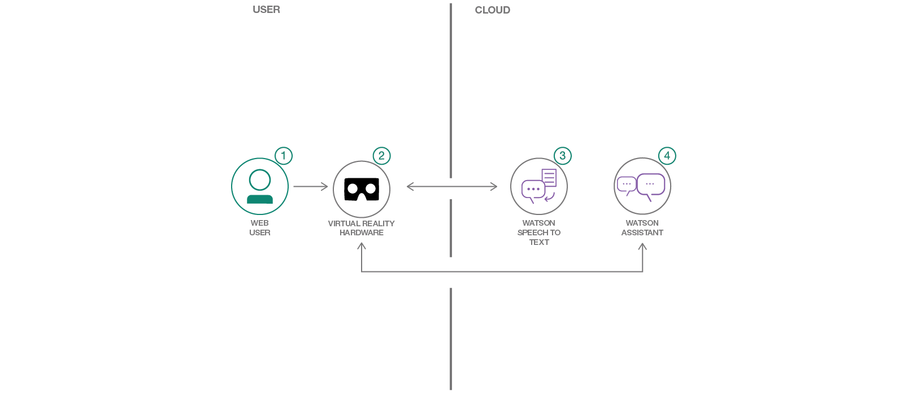

# Watson 서비스를 사용하여 음성 기반의 VR경험 구현하기

*다른 언어로 보기: [English](README.md).*

이번 개발 과정에서는 Watson  [Speech-to-Text](https://www.ibm.com/watson/developercloud/speech-to-text.html) 와 Watson  [Assistant](https://www.ibm.com/watson/developercloud/conversation.html) 서비스를 기반으로 VR(Virtual Reality, 가상 현실) 게임을 만들어보겠습니다.

우리가 실제 공간에 “있는” 것처럼 느껴지는 가상 현실 속에서 ‘말하기’는 다른 어떤 상호작용 방법보다 훨씬 자연스럽게 의사를 주고받을 수 있는 소통 수단입니다. 말하기 기능을 제공함으로써 개발자는 한층 몰입감 넘치는 경험을 만들어낼 수 있습니다. Google Cardboard는월등한 차이로 가장 인기있는 머리에 쓰는 VR 플랫폼으로,
[2016년 약 84만 대가 판매되었습니다](http://www.hypergridbusiness.com/2016/11/report-98-of-vr-headsets-sold-this-year-are-for-mobile-phones)

이 과정을 마치면 다음 방법을 이해할 수 있습니다.

* Unity에서 빌드한 가상 현실 환경에 IBM Watson Speech-to-Text 및 Assistant 추가.

# 동영상 보기

### With Watson

Watson 앱을 한 레벨 위로 끌어올리고 싶으신가요? 아니면 Watson 브랜드 기술을 활용하고 싶으신가요? 특별한 브랜딩, 마케팅 및 기술 자료를 제공하여 Watson 기반 상용 솔루션을 한층 업그레이드하고 개발 속도를 앞당겨주는 [With Watson](https://www.ibm.com/watson/with-watson) 프로그램에 가입하세요.

## 구성요소

* [IBM Watson Assistant](https://www.ibm.com/watson/developercloud/conversation.html): 음성이나 텍스트 기반의 대화형 프로그램 환경인 챗봇을 만들 수 있습니다.
* [IBM Watson Speech-to-Text](https://www.ibm.com/watson/developercloud/speech-to-text.html): 음성을 텍스트로 변환해 주는 서비스입니다.

## 주요 기술

* [Unity](https://unity3d.com/): PC, 콘솔, 모바일 디바이스, 웹 사이트용 비디오 게임을 개발하는 데 사용하는 크로스 플랫폼 게임 엔진입니다.
* [Google Cardboard](https://vr.google.com/cardboard/): 안드로이드폰에 탑재해서 VR앱을 볼 수 있는 저렴한 가격의 뷰어

# 단계

1. [시작 전 주의사항](#1-시작-전-주의사항)
2. [IBM Cloud 서비스 작성](#2-bluemix-서비스-작성)
3. [빌드 및 실행](#3-빌드-및-실행)

## 1. 시작 전 주의사항

* [IBM Cloud 계정](http://ibm.biz/Bdimr6)
* [Unity](https://unity3d.com/get-unity/download)
* [Google GVR Unity SDK](https://developers.google.com/vr/unity/get-started)
* [Android Unity SDK](https://docs.unity3d.com/Manual/android-sdksetup.html)

## 2. IBM Cloud 서비스 작성

로컬 시스템에서:
1. `git clone https://github.com/IBM/vr-speech-sandbox-cardboard.git`
2. `cd vr-speech-sandbox-cardboard`

[IBM Cloud](https://console.ng.bluemix.net/)에서:

1. [Speech-To-Text](https://console.ng.bluemix.net/catalog/speech-to-text/) 서비스 인스턴스를 생성합니다.
2. [Assistant](https://console.ng.bluemix.net/catalog/services/conversation/) 서비스 인스턴스를 생성합니다.
3. 대시보드에 서비스가 표시되면 생성된 Assistant 서비스를 선택하고   버튼을 클릭합니다.
4. Assistant Tool에 로그인한 후   버튼을 클릭합니다.
5. 이 저장소 복제본에 있는 Assistant [`workspace.json`](data/workspace.json)파일을 가져옵니다.

## 3. 빌드 및 실행

이전 단계를 수행했다면, 로컬 복제본으로 이미 이동하여 Unity에서 앱 실행을 시작할 수 있도록 준비된 상태여야 합니다.

1. `git clone https://github.com/IBM/unity-sdk`
2. Unity를 열고 프로젝트 대시보드에서   버튼을 선택합니다.
3. 이 저장소를 복제한 곳으로 이동해서 "Creation Sandbox" 디렉토리를 엽니다.
4. 프로젝트를 최신 Unity 버전으로 업그레이드하라는 메시지가 나타나면 업그레이드합니다.
5. [이 지침](https://github.com/IBM/unity-sdk#getting-the-watson-sdk-and-adding-it-to-unity) 에 따라 단계 1에서 다운로드한 Watson Unity SDK를 프로젝트에 추가합니다.
6. [이 지침](https://github.com/IBM/unity-sdk#configuring-your-service-credentials)에 따라 Speech To Text 및 Assistant 서비스 신임 정보([IBM Cloud](https://console.ng.bluemix.net/)에 있는)를 추가합니다.
7. 설정(configuration) 창에서 `Advanced Mode`를 선택합니다.
8. vr-speech-sandbox-cardboard/SpeechSandbox/Assests/Scripts/VoiceSpawner.cs 스크립트를 열고 Start() method의  #34 번 라인에 여러분의 workspace ID를 입력합니다. Workspace ID는 Assistant 워크스페이스에서 확장 메뉴(expansion menu)를 선택하고  `View details`를 선택하면 확인할 수 있습니다.
    
9. Unity 편집기 프로젝트 탭에서  Assets->Scenes->MainGame->MainMenu 를 선택하고 더블클릭하여 장면을 로딩합니다.
10. Play를 누릅니다.
11. 안드로이드용 .apk 파일을 빌드해서 여러분의 휴대전화에 실행하시려면,  File -> Build Settings (Ctrl + Shift +B) 으로 들어가서 Build를 클릭합니다
12. 실행이 되면, 빌드에 원하는 이름을 붙인 후 여러분의 휴대전화로 이동시킵니다.
13. 또는, 휴대전화를 USB로 연결한 후 File -> Build로 들어가 실행(또는 Ctrl+B)시킵니다.

   *USB 디버깅을 활성화했는지 반드시 확인 후 실행하십시오:*

* Settings -> About -> Software Information -> More 로 들어갑니다.

* 그런 후 “Build number”를 7번 탭하여 Developer 옵션을 활성화합니다.

* Setting 메뉴로 돌아가서 “Developer”옵션이 활성화되었는지 확인합니다.

* “Developer”옵션을 탭하여 다음 화면의 메뉴에서 USB 디버깅 기능을 켭니다.

   여러분의 휴대전화에 앱이 배포 완료되면 실행됩니다. 다만, 앱이 정상적으로 실행되기 전에 앱과 관련한 권한 설정을 해두어야 합니다.

  * Settings -> Apps -> SpeechSandboxCardboard -> Permissions로 들어가서 마이크와 스토리지를 활성화합니다.

# 링크

* [Youtube 데모](https://www.youtube.com/watch?v=rZFpUpy4y0g)
* [Watson Unity SDK](https://github.com/IBM/unity-sdk)

# 라이센스

[Apache 2.0](LICENSE)
