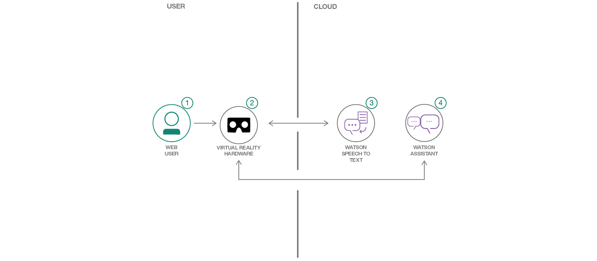

# Crie comandos de voz para experiências de RV com os serviços do Watson
*Ler em outros idiomas: [한국어](README-ko.md).*

Nesta jornada do desenvolvedor, criaremos um game de Realidade Virtual com base nos serviços [Speech-to-Text](https://www.ibm.com/watson/developercloud/speech-to-text.html) do Watson e [Assistant](https://www.ibm.com/watson/developercloud/conversation.html) do Watson.

Na Realidade Virtual, na qual você “habita” o espaço de verdade, a fala pode parecer uma interface mais natural do que outros métodos. A disponibilização de controles por fala permite que os desenvolvedores criem experiências mais imersivas. O Google Cardboard é, sem dúvida, a plataforma mais popular de RV para colocar na cabeça, com 84 milhões de unidades vendidas em 2016 (http://www.hypergridbusiness.com/2016/11/report-98-of-vr-headsets-sold-this-year-are-for-mobile-phones).
Após concluir esta jornada, o leitor saberá como:
* Incluir os serviços IBM Watson Speech-to-Text e IBM Watson Assistant em um ambiente de Realidade Virtual desenvolvido no Unity.

# Assista ao vídeo

### With Watson

Deseja levar seu aplicativo do Watson ao próximo nível? Quer aproveitar os ativos da marca Watson? Participe do programa [With Watson](https://www.ibm.com/watson/with-watson), que oferece recursos técnicos, de marketing e da marca exclusivos para amplificar e acelerar sua solução comercial incorporada do Watson.
## Componentes inclusos
* [IBM Watson Assistant](https://www.ibm.com/watson/developercloud/conversation.html): Crie um chatbot com um programa que faça uma conversa por métodos auditivos ou textuais.
* [IBM Watson Speech-to-Text](https://www.ibm.com/watson/developercloud/speech-to-text.html): Converta voz por áudio em texto escrito.
## Tecnologias utilizadas
* [Unity](https://unity3d.com/): Um mecanismo de game multiplataformas usado para desenvolver videogames para PC, consoles, dispositivos móveis e websites.
* [Google Cardboard](https://vr.google.com/cardboard/): Um visualizador barato instalado em um telefone Android para visualizar aplicativos de RV.
# Etapas
1. [Antes de começar](#1-before-you-begin)
2. [Crie os serviços do Bluemix](#2-create-bluemix-services)
3. [Desenvolvimento e execução](#3-building-and-running)
## 1. Antes de começar
* [Conta do IBM Bluemix](http://ibm.biz/Bdimr6)
* [Unity](https://unity3d.com/get-unity/download)
* [SDK do Google GVR Unity](https://developers.google.com/vr/unity/get-started)
* [SDK do Android Unity](https://docs.unity3d.com/Manual/android-sdksetup.html)
## 2. Crie serviços do Bluemix
Na sua máquina local:
1. `git clone https://github.com/IBM/vr-speech-sandbox-cardboard.git`
2. `cd vr-speech-sandbox-cardboard`
No [Bluemix](https://console.ng.bluemix.net/):
1. Crie uma instância de serviço do [Speech-To-Text](https://console.ng.bluemix.net/catalog/speech-to-text/).
2. Crie uma instância de serviço do [Assistant](https://console.ng.bluemix.net/catalog/services/conversation/).
3. Quando vir os serviços no painel, selecione o serviço Assistant que foi criado e clique no botão .
4. Depois de efetuar login na Assistant Tool, clique no botão .
5. Importe o arquivo do Assistant [`workspace.json`](data/workspace.json) localizado no seu clone deste repositório.
## 3. Desenvolvimento e execução
Se você seguiu as etapas anteriores, já deve estar dentro do seu clone local e pronto para começar a executar o aplicativo no Unity.
1. `git clone https://github.com/IBM/unity-sdk`
2. Abra o Unity e, dentro do ativador de projeto, selecione o botão .
3. Navegue até o local no qual clonou este repositório e abra o diretório “SpeechSandbox”.
4. Se for exibido um prompt pedindo para fazer upgrade do projeto para uma versão mais recente do Unity, faça isso.
5. Siga [estas instruções](https://github.com/IBM/unity-sdk#getting-the-watson-sdk-and-adding-it-to-unity) para incluir no projeto o SDK do Watson Unity transferido por download na 1ª etapa.
6. Siga [estas instruções](https://github.com/IBM/unity-sdk#configuring-your-service-credentials) para incluir suas credenciais dos serviços Speech To Text e Assistant (localizadas no [IBM Bluemix](https://console.ng.bluemix.net/)).
7. Selecione `Advanced Mode` na janela de configuração. 8. Abra o script vr-speech-sandbox-cardboard/SpeechSandbox/Assests/Scripts/VoiceSpawner.cs e insira seu ID da área de trabalho na linha nº 34 no método Start(). Para localizar o ID da área de trabalho, selecione o menu de expansão na área de trabalho do Assistant e selecione `View details`.  9. Na guia do projeto do editor do Unity, selecione Assets-&gt;Scenes-&gt;MainGame-&gt;MainMenu e clique duas vezes para carregar a cena.
10. Pressione Play.
11. Para desenvolver um arquivo .apk do Android e implementar no seu telefone, é possível selecionar File -&gt; Build Settings (Ctrl + Shift +B) e clicar em Build.
12. Quando for solicitado, você poderá nomear o desenvolvimento e movê-lo para seu telefone.
13. Como alternativa, conecte o telefone por USB e selecione File-&gt; Build and Run (ou Ctrl+B).

*Confira se a opção USB Debugging está ativada:*
* Abra Settings-&gt; About-&gt; Software Information-&gt; More
* Em seguida, toque em “Build number” sete vezes para ativar Developer options.
* Retorne ao menu Settings e você poderá ver “Developer options”.
* Toque na opção e habilite USB Debugging no menu na próxima tela. Depois que o aplicativo for implementado no seu telefone, ele será iniciado, mas você precisará definir as permissões para ele funcionar corretamente:
* Abra Settings-&gt; Apps-&gt; SpeechSandboxCardboard-&gt; Permissions e ative Microphone and Storage.

# Links
* [Demon no YouTube](https://www.youtube.com/watch?v=rZFpUpy4y0g)
* [SDK do Watson Unity](https://github.com/IBM/unity-sdk)

# Licença do [Apache 2.0](LICENÇA)
